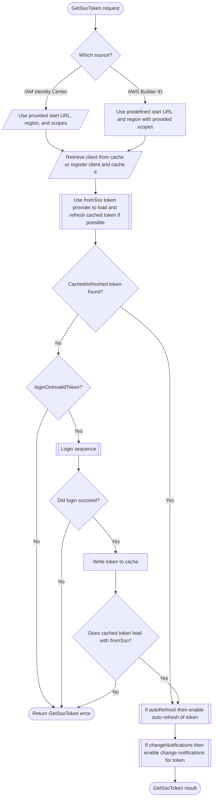

```mermaid
flowchart TD

Start(["`GetSsoToken request`"])
Error(["`Return GetSsoToken error`"])

Start --> WhichSource{"`Which source?`"}
WhichSource -->|IAM Identity Center| IamIdentityCenter[/"`Use provided start URL, region, and scopes`"/]
WhichSource -->|AWS Builder ID| AwsBuilderId["`Use predefined start URL and region with provided scopes`"]

CreateClient[/"`Retrieve client from cache or register client and cache it`"/]
IamIdentityCenter --> CreateClient
AwsBuilderId --> CreateClient

FromSso[["`Use *fromSso* token provider to load and refresh cached token if possible`"]]
CreateClient --> FromSso
FromSso --> TokenFound{"`Cached/refreshed token found?`"}
TokenFound -->|Yes| AutoRefresh[["`If autoRefresh then enable auto-refresh of token`"]]
TokenFound -->|No| LoginOnInvalidToken{"`loginOnInvalidToken?`"}

LoginOnInvalidToken -->|No| Error
LoginOnInvalidToken -->|Yes| LoginSequence[["`Login sequence`"]]

LoginSequence --> LoginSucceeded{"`Did login succeed?`"}
LoginSucceeded -->|No| Error
LoginSucceeded -->|Yes| WriteCache["`Write token to cache`"]

WriteCache --> FromSso2{"`Does cached token load with *fromSso*?`"}
FromSso2 -->|Yes| AutoRefresh
FromSso2 -->|No| Error

AutoRefresh --> ChangeNotifications[["`If changeNotifications then enable change notifications for token`"]]
ChangeNotifications --> End

End(["`GetSsoToken result`"])
```